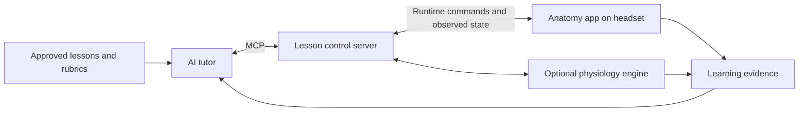

# Open-source XR for nursing anatomy and physiology

Reviewed September 11, 2026. This review follows the user's clarification that anatomy and physiology are the priority. The September 9 site-visit notes supply background about competency-based nursing education; their proposed follow-ups are not new instructions or approved implementation decisions.

**Recommendation:** evaluate IU's HRA Organ Gallery for anatomy, Bodylight for browser-based physiology teaching, and 3D Slicer for an initial MCP automation experiment. Use Pulse when lessons need computed physiological responses. A single application covering all of these functions on both Quest and Vision Pro was not established by this review.

Evidence comes from project documentation, repositories, selected source files, licenses, and repository activity. No application was installed, built, or tested on a headset. “Documented” below means supported by the cited project evidence, not independently verified in the lab. Integration proposals and relative effort are engineering judgments.

## Shortlist

| Candidate | What it supplies | Meta Quest | Apple Vision Pro | Proposed MCP role |
| --- | --- | --- | --- | --- |
| **HRA Organ Gallery** | Existing anatomy application from IU; organ and tissue exploration | Documented standalone Quest use | No native support verified; port required | Select organs, change scale, guide observation, record learner selections |
| **3D Slicer + SlicerVirtualReality** | Existing medical image and anatomy visualization application | Documented Quest 3 through a Windows PC and Link/Air Link | Extension explicitly lacks a supported Vision Pro backend | Load teaching scenes, isolate structures, adjust slices and views; community MCP already exists |
| **Bodylight VirtualBody / VR demos** | Existing simplified anatomy and physiology web applications | Project reports testing on Quest 2 browser | WebXR port candidate; application compatibility unverified | Change supported model inputs, pause/reset simulations, collect outputs |
| **Pulse Physiology Engine / Explorer** | Physiology engine plus desktop exploration UI | Integration component, not a finished Quest app | Integration component, not a finished Vision Pro app | Initialize patient state, apply supported actions, advance time, read results |
| **Z-Anatomy** | Anatomy content, Blender atlas, and a Unity PC viewer | Requires XR adaptation | Requires XR adaptation | Structure lookup, visibility, labels, guided anatomy tasks |
| **Open Twin XR** | Very new WebXR anatomy viewer | WebXR path claimed; device operation unverified | WebXR path proposed; device operation unverified | Structure and layer selection through a new runtime adapter |

The supporting evidence and limitations for each candidate follow.

## HRA Organ Gallery: first anatomy app to evaluate

The Human Reference Atlas Organ Gallery comes from researchers at Indiana University and collaborators. It connects organs with tissue and cellular information; its original study documents Quest 2, while a later IU demonstration documents standalone Quest 3. This offers a relevant local research connection, though no involvement by the Fort Wayne nursing program has been established. [Project paper](https://pmc.ncbi.nlm.nih.gov/articles/PMC9949060/), [IU Quest 3 demonstration](https://cns-iu.github.io/data-vis-xr-panel-2025/).

The repository's changelog records version 2.4 on June 10, 2026. It includes organ selection, scaling, and tissue visibility features, alongside known transparency and label-rendering issues. Its research focus will require a simpler nursing lesson interface. [Source and changelog](https://github.com/cns-iu/hra-organ-gallery-in-vr/blob/main/CHANGELOG.md).

**MCP approach:** add a small C# runtime command bridge to the Unity app, calling the same application logic used by its interaction controls. Expose organ selection, scene reset, scale, and selected-structure state. Do not mistake the HRA data API for an API controlling an active headset session. The source contains an interaction-driven selection manager, but a supported external control API was not established. [Selection source](https://github.com/cns-iu/hra-organ-gallery-in-vr/blob/main/hra-organ-gallery/Assets/Scripts/Data/SelectionManager.cs).

**Openness:** the 2023 paper explicitly states that code was released under CC BY 4.0. The current repository has no top-level license file identified in this review, so confirm the current code release and bundled asset terms before adopting a fork. Unity remains an external engine dependency. No Vision Pro build was found. This is an anatomy foundation; dynamic whole-body physiology would be additional work. [Code availability statement](https://pmc.ncbi.nlm.nih.gov/articles/PMC9949060/).

## 3D Slicer: strongest immediate MCP experiment

Slicer supplies imaging, segmentation, surface models, and Python/C++ extensibility. Its core uses a BSD-style license; SlicerVirtualReality uses Apache 2.0. These are separate from the licenses of teaching datasets. [Slicer overview and license](https://slicer.readthedocs.io/en/latest/user_guide/about.html), [VR extension](https://github.com/KitwareMedical/SlicerVirtualReality).

The extension recommends a recent Slicer Preview Release, OpenXR, and Quest 3. Rendering runs on a Windows computer, connected through Link or Air Link. Its documentation explicitly says the macOS extension lacks a Vision Pro backend. This is a PC-based option, not an installation running independently on Quest. [Device and installation documentation](https://github.com/KitwareMedical/SlicerVirtualReality).

A community **mcp-slicer** already exposes node listing, Python execution, and screenshots through Slicer's WebServer. Its package declares MIT and pre-alpha status; its README says it is a third-party integration and not recommended for production. This establishes a useful prototype route, not classroom readiness. [MCP implementation](https://github.com/zhaoyouj/mcp-slicer), [package metadata](https://github.com/zhaoyouj/mcp-slicer/blob/main/pyproject.toml).

**MCP approach:** create narrow lesson tools for approved atlas loading, structure visibility, camera orientation, and slice position. Return scene state after every command. Slicer's WebServer already provides an integration surface; keep its powerful Python execution endpoint local behind the lesson adapter. [WebServer documentation](https://slicer.readthedocs.io/en/latest/user_guide/modules/webserver.html).

Best demonstration: open a prepared chest atlas, isolate the lungs, show their relationship to the heart, and ask the learner to identify structures. Curated scenes and a student interface are still needed. Dynamic physiology is a separate integration.

## Bodylight: closest existing browser-based physiology experience

Bodylight's VR page includes breathing and VirtualBody demos combining simplified anatomy with physiological models. It reports Quest 2 browser testing and describes hemodynamics models compiled from Modelica through FMU into WebAssembly. It does not establish Vision Pro application compatibility. [Bodylight VR overview and demos](https://bodylight.physiome.cz/VR/).

VirtualBody is an MIT-licensed web application, with an ENTER VR workflow. Its README identifies externally hosted GLTF models and a mechanism to cache them locally. The app repository last received a push in August 2024, while related components and scenarios show activity in 2026. The newer library activity does not prove that the older VR app is maintained or working on current headsets. [VirtualBody source](https://github.com/creative-connections/Bodylight-VirtualBody), [components](https://github.com/creative-connections/Bodylight.js-Components), [scenarios](https://github.com/creative-connections/Bodylight-Scenarios).

**MCP approach:** wrap model input/output bindings in a session service and add a browser command channel. Expose only parameters present in the selected model, with explicit units and accepted ranges. Provide pause, reset, and output sampling. The libraries document FMI components and chart bindings, which are more useful integration points than simulated mouse clicks. [Component documentation](https://github.com/creative-connections/Bodylight.js-Components).

Best use: predict a physiological change, manipulate one parameter, observe the model, and explain the result. Verify model and artwork provenance separately from the MIT application license. Inspect older dependencies, model availability, immersive controls, and language coverage before selection.

## Pulse: preferred deeper physiology component

Pulse is Apache-2.0 software with a C++ engine, language interfaces, and a desktop Physiology Explorer. Its Unity integration lists Android, xrOS, and WebGL builds among its targets. Those are integration targets; they do not establish a finished nursing app on either headset. [Pulse project and downloads](https://pulse.kitware.com/).

The engine API supports initialization, actions, explicit time advancement, and data retrieval. Examples of supported actions include hemorrhage and airway obstruction. These are suitable building blocks for repeatable physiology lessons. [Engine API](https://pulse.kitware.com/physeng.html).

**MCP approach:** run one engine instance per learning session in a backend service; expose approved baseline states and scenario actions. Serialize commands with time advancement, since the documentation assigns concurrency coordination to the integrator. Stream derived values to the XR client through the app's normal data connection. Save the engine version, starting state, and action log for reproducibility. [Engine execution model](https://pulse.kitware.com/physeng.html).

Best use: show how a faculty-selected blood-loss scenario changes simulated circulatory variables, then ask the student to explain the trend. The model should calculate numerical outputs. The tutor explains those outputs against course material. Connecting values to animated organs requires explicit design and validation; an animated heart alone is not evidence of a physiological simulation.

## Anatomy assets and emerging alternatives

For a concrete visual reference, see [Hannah Newey’s *Cardiac Anatomy: External view of human heart*](https://sketchfab.com/3d-models/cardiac-anatomy-external-view-of-human-heart-a3f0ea2030214a6bbaa97e7357eebd58). The [visual quality standard](anatomy-visual-quality-standard.md) describes the intended presentation, and the [nursing anatomy resource map](nursing-anatomy-resource-map.md) extends sourcing across body systems. The heart’s listed CC BY-NC-SA 4.0 asset license is separate from any viewer’s software license.

**Z-Anatomy** offers a navigable Blender atlas and a separate Unity PC viewer. Neither reviewed source documents a current Quest or Vision Pro application. It is more useful as content to adapt than as an immediately deployable headset app. The Unity viewer's latest listed release is from 2022. [Blender atlas](https://github.com/Z-Anatomy/Models-of-human-anatomy), [Unity viewer](https://github.com/LluisV/Z-Anatomy).

The upstream atlas declares CC BY-SA 4.0 overall but also lists individual assets with noncommercial licenses, including kidney and inner-ear material. Track licenses per included model; the headline license does not settle the entire collection. [Upstream attribution list](https://github.com/Z-Anatomy/Models-of-human-anatomy#attributions).

**Open Twin XR** is a promising experiment using React/Three.js and WebXR, with structure identification, layers, and atlas loading. Its source declares MIT, but anatomy is separately licensed and not included in the default checkout; placeholders appear until assets are installed. The repository explicitly reports mixed asset-license issues and an unimplemented AI layer. It was created in August 2026. Treat it as a code-inspection candidate, with build and headset trials required before choosing it as a foundation. [Repository](https://github.com/Opening-Science/open-twin-xr).

**Open Anatomy Browser** is useful for atlas content and desktop teaching, but its own documentation describes a prototype desktop browser viewer, not established immersive headset support. [Open Anatomy Project](https://www.openanatomy.org/).

**Hubs and Ubiq** remain candidates if shared rooms or group teaching become priorities. Their reviewed features address collaboration and networking; they do not supply the anatomy or physiology lesson itself. [Hubs](https://docs.hubsfoundation.org/), [Ubiq](https://github.com/UCL-VR/ubiq).

## If both headsets are required

My preferred architecture is a small WebXR lesson client using vetted anatomy assets, with a separate physiology service when needed. A-Frame's documented device list includes both Quest and Vision Pro. Apple documents immersive WebXR in Safari starting with visionOS 2 and an eye-and-pinch input model. That provides a credible development route, not automatic compatibility for every existing WebXR app. [A-Frame device support](https://aframe.io/docs/1.8.0/introduction/vr-headsets-and-webxr-browsers.html), [Apple WebXR support](https://webkit.org/blog/15865/webkit-features-in-safari-18-0/).

Use immersive VR as the first common target; do not assume passthrough AR or controller parity. Test entry, selection, scaling, labels, audio, and session recovery separately on each headset. The HRA reference library is another relevant content source: its organs are developed by medical illustrators and reviewed by organ experts. Check each selected model's distribution terms. [HRA reference objects](https://3d.nih.gov/collections/hra).

## Proposed MCP contract

MCP would let a tutor or faculty assistant discover and invoke application tools. The runtime bridge still has to be implemented for each selected app. MCP server tools are documented protocol primitives; the tool names below are proposals for this project. [MCP architecture](https://modelcontextprotocol.io/docs/learn/architecture).

| Proposed tool | Purpose |
| --- | --- |
| `list_structures(atlas_version)` | Obtain real structure identifiers and available anatomy |
| `show_structure(session_id, structure_id, mode)` | Isolate or highlight an existing structure |
| `set_view(session_id, preset)` | Apply a supported scale/orientation preset |
| `start_lesson(session_id, lesson_id, version)` | Load an approved lesson and baseline |
| `apply_scenario_action(session_id, action_id, parameters)` | Apply a supported physiological change with checked units/ranges |
| `advance_simulation(session_id, seconds)` | Advance a bounded interval of simulated time |
| `read_state(session_id)` | Confirm visible anatomy and computed physiology |
| `get_learning_evidence(session_id)` | Return student selections, predictions, responses, and timestamps |

All tools should address an explicit session, return whether the runtime actually applied the command, and reject unsupported structure IDs and actions. Head tracking, rendering, audio transport, and continuous simulation remain in their normal runtime loops. An editor-only Unity MCP would not by itself control an installed Quest app.

## First nursing lesson and evaluation

Start with a faculty-authored **heart, lungs, and circulation** exercise: identify structures, explain their relationships, predict a response to a defined scenario, observe the simulation, and explain the result in nursing terms. This is a proposed exercise, not an official AACN lesson or validated rubric.

AACN Domain 1 is the relevant starting mapping: 1.2a concerns applying scientific knowledge and 1.3a concerns clinical reasoning. Anatomy identification can supply part of the evidence; faculty must determine what demonstrates the broader competency. Keep objective and rubric versions outside the model, as discussed in the site-visit notes. [AACN Domain 1](https://www.aacnnursing.org/essentials/tool-kit/domains-concepts/knowledge-for-nursing-practice).

Recommended evaluation sequence:

1. **Anatomy fit:** try HRA Organ Gallery on Quest with faculty and determine whether its structure coverage and research interface suit the lesson. Resolve the current release's license documentation before a fork.
2. **Automation feasibility:** if a Windows VR workstation is available, use a prepared Slicer scene to demonstrate selection, isolation, reset, and state confirmation through a narrow MCP adapter.
3. **Physiology fit:** run one Bodylight model and one Pulse scenario on desktop first. Compare supported variables and educational clarity with faculty expectations.
4. **Cross-headset feasibility:** if Vision Pro is required, test the same minimal anatomy interaction on both devices using WebXR before adapting a large app.
5. **Learning evidence:** retain observed actions and explanations; compare tutor feedback with faculty judgments before using scores consequentially. Canvas integration can follow once the exercise and evidence format are established.

The practical choice depends on the first milestone: **HRA for an existing Quest anatomy experience; Slicer for proving MCP control; Bodylight for an existing physiology web demo; a WebXR client plus Pulse for a more substantial application spanning both headsets.**
